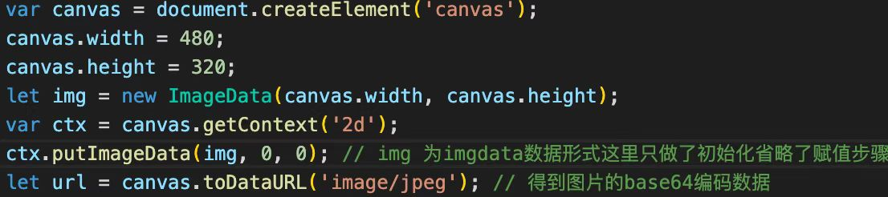
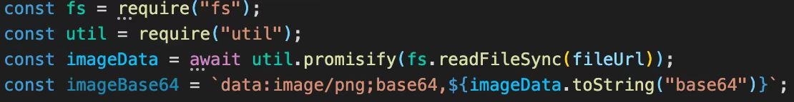
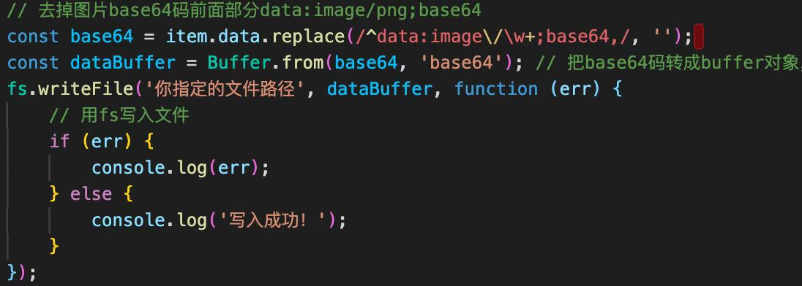

### 将canvas所绘制的图像转成图片格式保存到本地

1. **首先base64图片格式一般都是以下形式：**
   <!-- ‘data:image/jpeg;base64, […base64编码]’ -->

2. **当我们在使用canvas绘图完成后可使用 .toDataURL( )来得到所绘制图像的base64编码数据形式**

3. **当然也可以将图片格式转成base64格式**

4. 输出指定文件夹处理
   首先我们需要使用引入第三方工具类，即是

   ```javascript
   const fs = require(‘fs’); 
   ```




### Css: content-visibility属性 [虚拟滚动]

> content-visibility是一个css属性，它控制一个元素是否呈现其内容，能让用户潜在地控制元素的呈现。用户可以使用它跳过元素的呈现(包括布局和绘制)，直到用户需要为止，让页面的初始渲染得到极大的提升。


**content-visibility** 属性有三个可选值:

> - visible: 默认值。对布局和呈现不会产生什么影响。
>
> - hidden: 元素跳过其内容的呈现。用户代理功能（例如，在页面中查找，按Tab键顺序导航等）不可访问已跳过的内容，也不能选择或聚焦。类似于对其内容设置了display: none属性。
> - auto: 对于用户可见区域的元素，浏览器会正常渲染其内容；对于不可见区域的元素，浏览器会暂时跳过其内容的呈现，等到其处于用户可见区域时，浏览器在渲染其内容。

- **ps**: content-visibility是chrome85今年新增的特性，所以目前兼容性还不高，但是相信兼容性的问题在不久的将来会得到解决。


​	当元素的部分内容如``标签这种，元素的高度是有图片内容决定的，因此在这种情况下，如果使用`content-visibility`，则可见视图外的img初始未渲染，高度为0，随着滚动条向下滑动，页面高度增加，会导致滚动条的滚动有问题。


​	为了解决此问题，如果在已知元素高度的情况下，可以使用`contains-intrinsic-size`属性，为上面的card添加：`contains-intrinsic-size：312px;`，这会给内容附一个初始高度值。（如果高度不固定也可以附一个大致的初始高度值，会使滚动条问题相对减少）。

```css
    <style type="text/css">
      .card {
        margin-bottom: 10px;
        content-visibility: auto;
        contain-intrinsic-size: 312px; // 添加此行
      }
    </style>
```